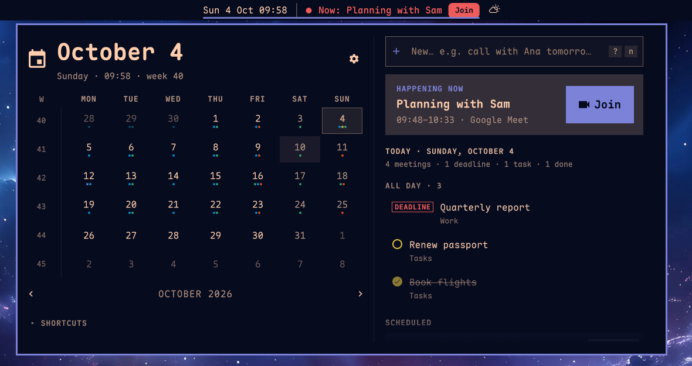
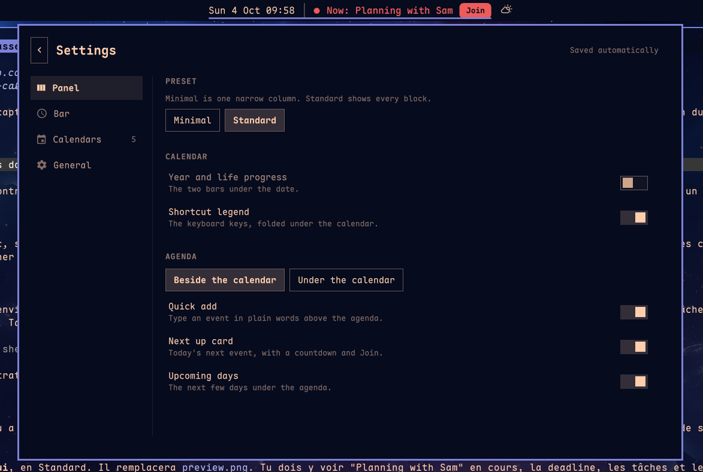

# Calendar for Omarchy

**Your Google Calendar, in your Omarchy bar.** A month view with your real
events on it, a bar that tells you what is coming before it starts, and a
form to create or edit events without opening Google.

Not a Google user? The sync reads any iCal feed, see
[Sync from the secret iCal address](#sync-from-the-secret-ical-address). The
widget itself reads a plain JSON file, so khal, vdirsyncer or Nextcloud work
just as well. See [Use another source](#use-another-source).



It replaces the built-in clock rather than sitting beside it, so you keep one
icon. Left click opens a month calendar with your real events on it. When
something is close, the bar itself stops being just a clock and tells you:


The clock stays. This widget takes the desktop clock's place, so trading the
time away for an event title would be a downgrade you pay for all day.

## Features

- **Three columns.** The month grid you know on the left, the day's agenda in
  the middle, and the selected event's details on the right. The details
  column only opens when you click something
- **Nothing cut off.** Titles wrap instead of trailing off in an ellipsis
- **Deadlines and tasks look like what they are.** Titles starting with
  `DEADLINE:`/`PRAZO:`/`Due:` get a badge and come first. Rows from a task
  calendar (Todoist, Google Tasks) get a circle, and done ones (`✓ …`) are
  struck through
- **A meeting button on every meeting**, whatever the time. It turns into a
  filled **Join** from 15 minutes before the start. Links are found in
  Google's conference data, and also in the location or description of an
  invitation forwarded by email (Meet, Zoom, Teams, Webex, Jitsi, Whereby)
- **Next up card**: what is next today, with a countdown and Join
- **Upcoming days** under the selected day, so the week is one glance away
- **Quick add** in plain English or Portuguese: `call with Ana tomorrow 2pm
  for 45m`, `dentista sexta às 15h`. You see the parsed date before you
  press Enter. Read-only sources open Google Calendar with the event filled in
- **Details** on click: full title, when, Join, directions, description,
  reminder. Double click edits (writable calendars) or opens the event in
  Google
- **Create, edit and delete** from the panel, with a form like Google's: date
  picker, times in 15-minute steps, repeat, guests with suggestions, Google
  Meet, notifications, colour. Off by default, see
  [Create and edit events](#create-and-edit-events)
- **The bar escalates** as a meeting nears: a quiet title, then the accent
  colour and a Join chip, then the urgent colour once it starts. A `+1`
  shows when two things start at once. Middle click joins
- **Desktop reminders** from your Google notification times (10 minutes for
  meetings without one). Clicking one joins the call, also from the
  notification history. A shell reload never repeats them. See
  [Reminders](#reminders)
- **Keyboard first**, see [Keyboard](#keyboard)
- **English and Portuguese**, following your locale or set by hand
- Per-calendar visibility, week start, countdown lead time and a 24 h or 12 h
  time format
- Google's working-location markers hidden by default, declined invitations
  struck through
- Everything the built-in Omarchy clock does: label formats, right click to
  cycle them, the year and life progress bars if you want them back
- Theme aware, light themes included, because it is a fork of the built-in clock
- No Google Cloud project needed if you read your calendars from their secret
  iCal address (read only), through Evolution Data Server
  (community-maintained), or from any other source that writes the events file

## Requirements

Omarchy 4 with Quickshell. Google Calendar is optional, see
[Use another source](#use-another-source). A Google Cloud project is optional
too, see [Sync from the secret iCal address](#sync-from-the-secret-ical-address)
or [Sync without a Google Cloud project](#sync-without-a-google-cloud-project).

## Install

```bash
omarchy plugin add https://github.com/tmn73/omarchy-calendar.git --enable
```

This widget **replaces** the built-in clock. In `~/.config/omarchy/shell.json`,
remove the `omarchy.clock` entry from `bar.layout.center` and point
`bar.centerAnchor` at `tmn73.calendar`:

```json
{
  "bar": {
    "centerAnchor": "tmn73.calendar",
    "layout": {
      "center": [
        {
          "id": "tmn73.calendar",
          "format": "dddd HH:mm",
          "eventTimeFormat": "HH:mm"
        }
      ]
    }
  }
}
```

Then:

```bash
omarchy restart shell
```

**Installing is not the whole job.** At this point you have a working clock and
an empty calendar, because nothing is feeding it yet. Connect Google Calendar
below, or point any other source at the file. The widget says as much when you
open it, with the command to run.

## Sync your Google Calendar

> **Only need to read your calendar?** `setup --ics` skips Google Cloud and
> reads your calendar's secret iCal address instead. You cannot edit events
> from the panel that way. See
> [Sync from the secret iCal address](#sync-from-the-secret-ical-address).

```bash
~/.config/omarchy/plugins/tmn73.calendar/sync/setup
```

Run it in a real terminal. It pauses for input, and four steps have to be done
by hand in the Google Cloud Console.

**You need your own Google OAuth client.** There is no shared one, and that is
not laziness. `calendar.readonly` is a Google *sensitive* scope, so a publicly
distributed client would need Google verification and is capped at 100 users
until it gets it. This is exactly why `gcalcli`'s shared token is currently
restricted. Every user brings their own credentials.

The script automates what has an API:

- an isolated `gcloud` configuration, so your other projects are untouched
- creating the Google Cloud project
- enabling the Calendar API
- installing the downloaded client secret, with the right permissions
- the scoped login, and verifying the scope was actually granted
- the systemd timer

It stops and waits for the four things Google exposes no API for: the consent
screen, declaring the calendar scope, publishing the app, and creating the
Desktop OAuth client. Each one prints the exact URL and the exact values.

Two of those steps are traps, and the script says so at the time:

- **Declaring the scope under Data Access is not optional.** A scope that is
  not declared there is never offered on the consent screen, so there is no box
  to tick, Google silently grants only your email address, and every sync then
  fails with `403 insufficient scopes` while the login reports success.
- **Publish the app.** While it sits in Testing, Google expires refresh tokens
  after seven days and your calendar quietly stops updating. Unverified
  production apps show a one time warning screen and then work indefinitely.

When it finishes, events land in `~/.local/state/omarchy/calendar-events.json`
every five minutes and the widget picks them up without a restart.

## Create and edit events

Off by default. Turn it on and the panel gets a **+** next to the day's
agenda (or press `n`), and a pencil and a trash can when you hover one of
your own events.

It needs one more Google scope, `calendar.events`. That scope can see and
edit events. It cannot change sharing or delete a calendar.

New setup: answer yes when `sync/setup` asks, or run `sync/setup --write`.

Already set up:

1. In the Cloud Console, under **Data Access**, add `calendar.events` next to `calendar.readonly`.
2. Log in again with both scopes. The `rm` drops the cached token, which gws
   would keep serving without the new scope:

   ```bash
   rm -f ~/.config/gws-omarchy-calendar/token_cache.json
   GOOGLE_WORKSPACE_CLI_CONFIG_DIR=~/.config/gws-omarchy-calendar gws auth login \
     --scopes https://www.googleapis.com/auth/calendar.readonly,https://www.googleapis.com/auth/calendar.events
   ```

3. Set `"write": true` in `~/.config/omarchy/calendar-sync.json`.

Only calendars you own or can edit get the pencil and the trash can. The
form follows Google's: start and end dates with a date picker, times in
15-minute steps in your `eventTimeFormat`, all day, repeat, guests, Google
Meet, location and description. Under "More options": notifications, busy
or free, visibility, colour and guest permissions.

With guests, the panel asks whether to send invitation emails. For a
recurring event, it asks whether the change is for this event or all
events. To move an event to another calendar, use Google Calendar. A repeat rule the menu cannot show, or a notification it has no
entry for, stays as it is unless you pick another one.

The EDS backend cannot write yet, so the panel shows none of this there.

## Sync from the secret iCal address

The least setup of all, and read only. Google publishes every calendar at a
private iCal address, so the sync can read that instead: no Google Cloud
project, no OAuth client, no consent screen, no Evolution. Suggested in #32.

```bash
~/.config/omarchy/plugins/tmn73.calendar/sync/setup --ics
```

It asks for the address (Google Calendar on the web: Settings > your calendar >
Integrate calendar > *Secret address in iCal format*), runs a test sync, then
writes it to `~/.config/omarchy/calendar-sync.json` with mode 600 and installs
the timer. If the test sync fails, your current config stays as it was. Or by
hand:

```json
{
  "backend": "ics",
  "identity": "you@example.com",
  "ics": [
    { "url": "https://calendar.google.com/calendar/ical/.../private-.../basic.ics" },
    { "url": "webcal://example.com/other.ics", "name": "Other", "color": "#33b679" }
  ]
}
```

Needs `python-icalendar` and `python-recurring-ical-events` (the setup installs
them). Any https or webcal iCal feed works, not only Google's.

The trade: no creating or editing events, and Google refreshes the feed on its
own schedule so a change can take a while to show up. The feed carries no link
to an event, so for a Google feed the sync builds one from the event's UID and
the calendar id in the address; an occurrence of a repeating event opens the
series, and an event from any other feed opens nothing. Descriptions and
pop-up reminders (`VALARM`) come through. Treat the address as a password;
reset it in Google Calendar if it leaks.

To go back to the Google Cloud sync, run `setup` again without `--ics`.

## Sync without a Google Cloud project

> **Community-maintained.** The author does not run Evolution Data Server, so
> the people who use this backend are the ones who test it. When you open an
> issue about it, say that you are on the EDS backend.

The setup above needs a Google Cloud project because `calendar.readonly` is a
Google *sensitive* scope, so a publicly distributed client would need
verification. There is a way around that: read the calendars out of
**Evolution Data Server**, which signs in with GNOME's already-verified OAuth
client. No project, no consent screen, no scope declaration, no
`client_secret.json`, and no Testing-mode refresh token expiring after seven
days. Just a browser sign-in.

The trade is roughly 20 packages, and a GUI is needed once to sign in.

```bash
sudo pacman -S evolution-data-server evolution
```

Describe the account in `~/.config/evolution/sources/google.source`:

```ini
[Data Source]
DisplayName=Google (you@example.com)
Enabled=true
Parent=

[Collection]
BackendName=google
Identity=you@example.com
CalendarEnabled=true
ContactsEnabled=false
MailEnabled=false

[Authentication]
Method=Google
User=you@example.com
Host=www.google.com
RememberPassword=true
```

Writing that by hand is not laziness either. Evolution's Collection Account
wizard resolves a custom Workspace domain to Google's *mail* servers and then
asks for a password to discover CalDAV, rather than reusing the Google OAuth2
provider it already ships. It offers no calendar at all, and the wizard is a
dead end. The file skips it.

Then sign in once:

```bash
evolution -c calendar
```

Its credential prompter opens Google's sign-in, EDS discovers the calendars
over CalDAV, and the refresh token goes to your keyring. Evolution is not
needed again unless Google later wants a re-auth and needs a window to ask in;
the data server keeps running headless.

Finally point the sync at it in `~/.config/omarchy/calendar-sync.json`:

```json
{
  "backend": "eds",
  "identity": "you@example.com"
}
```

`identity` is the address whose invitation answers count as yours, which is
what makes "hide declined events" work. Leave it out and `responseStatus` is
left unset rather than guessed from the first attendee.

The same systemd timer drives it, `calendars.include`/`exclude` and `window`
behave identically, and the file written is the same contract, so switching
backends changes nothing the widget can see.

One known limit: clicking an event opens nothing on this backend, because
CalDAV does not carry Google's link to the event.

## Use another source

The widget has no idea Google exists. It reads one file and renders it:

```
~/.local/state/omarchy/calendar-events.json
```

Anything that writes that file works: khal, vdirsyncer, Nextcloud, an ICS feed,
a shell script, a cron job of your own. No credentials, no network, no `gws`.

```json
{
  "version": 1,
  "syncedAt": "2026-08-10T16:42:00+00:00",
  "source": "whatever produced this",
  "events": [
    {
      "id": "any-stable-id",
      "calendarId": "work@example.com",
      "calendarName": "Work",
      "color": "#f83a22",
      "dateKey": "2026-08-10",
      "start": "2026-08-10T19:15:00-05:00",
      "end": "2026-08-10T20:15:00-05:00",
      "allDay": false,
      "title": "Tax filing",
      "location": ""
    }
  ]
}
```

These extra fields are optional. Omit them and everything still works:

| Field | Effect |
|---|---|
| `meetingUrl` | Shows the **Join** button around the event's time. Must be `https`, anything else is dropped |
| `eventUrl` | Opens the event in its calendar. Must be `https` |
| `eventType` | `workingLocation` is hidden by default, `outOfOffice` is labelled |
| `responseStatus` | `declined` is struck through, and can be hidden entirely |
| `description` | Shown in the event details. Plain text only, never rendered as markup; the bundled sync strips HTML, decodes entities and caps it at 1500 characters |
| `reminders` | List of whole minutes before the start, e.g. `[10, 60]`, at which to raise a desktop notification. `[]` or absent means none given. The bundled sync takes Google's pop-up reminders (the calendar's defaults when the event uses them) or an iCal feed's `DISPLAY`/`AUDIO` alarms counted from the start; e-mail reminders are left out |

A top-level `writableCalendars` list (`id`, `name`, `color`) turns on the
panel's edit buttons for those calendars. Only the bundled sync should write
it: the panel sends its edits to the bundled event command, not to your writer.

Rules a writer has to follow:

- `dateKey` is `YYYY-MM-DD` in local time, and it is what the grid keys on.
- A multi-day event is emitted **once per day it covers**, each row with its own
  `dateKey`. Those rows share an `id`, so the unique key for a row is
  `id + dateKey`.
- `allDay` events are excluded from the countdown, since counting down to
  midnight tells you nothing.
- Write the file atomically, temp file then rename. The widget watches it.
- Unknown fields are ignored, so you can add your own.

`tests/fixtures/calendar-events.json` is a valid two-event file to start from.

Writers other people have built:

- [Thunderbird](https://gist.github.com/marijn070/413704a12a00f7501ab1d52dc08b9a4e)
  by @marijn070. A Nushell script that reads Thunderbird's local calendar, so
  every source you already aggregate in Thunderbird shows up in the widget.

## Keyboard

With the panel open:

| Key | Does |
|---|---|
| `←` `→` / `↑` `↓` | Previous / next day, previous / next week |
| `[` `]` | Previous / next month (`{` `}` for years) |
| `t` | Today |
| `j` `k` | Next / previous item of the selected day |
| `Enter` | Show or hide the selected item's details |
| `n` | Quick add |
| `e` | Edit the selected event |
| `m` | Join the selected meeting, else the next one |
| `o` | Open the selected event in Google |
| `w` | Toggle the week start |
| `Esc` | Back out one step: dialog, form, details, selection, then the panel |

`omarchy-shell tmn73.calendar join` joins the next meeting from anywhere, for
a Hyprland binding.

## Reminders

The bar widget sends them, so they work with the panel closed.

- **When:** at the times set in Google (popup reminders). A meeting with a
  link but no reminder gets one 10 minutes before. All-day events only remind
  when they have their own reminder, counted back from midnight like Google
  does
- **Clicking one:** joins the call, or opens the event when there is no link
- **Late or repeated:** if the laptop slept through a reminder, it still
  fires on wake, as long as the event has not started. Reminders already sent
  are remembered for the session, so restarting the shell never repeats one
- **Snooze:** for 15 minutes after a reminder, the next-up card and the
  event's details offer "Snooze 5 min"
- **Turning them off:** set `"reminders": false` in the widget's entry in
  `shell.json`

## Settings

Click the clock, then the gear icon in the panel header.



| Section | What it does |
|---|---|
| Calendars | Show or hide each calendar. The list comes from your own events, so it needs no configuration |
| Week starts on Monday | Off starts the week on Sunday |
| Working location events | Google's work-from-home markers. Hidden by default because they are all-day rows describing no commitment |
| Declined invitations | On lists them struck through, off hides them entirely |
| Year and life progress | Brings back the built-in clock's bars, off by default |
| Bar label | How early the bar announces what is next: never, 5, 15, 30 or 60 minutes |
| Language | Automatic (follows your locale), English or Português |
| Event times | Set `eventTimeFormat` in `shell.json` to a Qt date-time format such as `HH:mm` or `h:mm AP` |
| Sync | Event count, source and last sync time, for diagnosing a quiet calendar |

Hiding a calendar is instant and does not change what the sync fetches, so
bringing one back does not wait for the next run.

Sync behaviour lives in `~/.config/omarchy/calendar-sync.json`:

```json
{
  "profile": "~/.config/gws-omarchy-calendar",
  "gwsPath": "/absolute/path/to/gws",
  "calendars": { "include": [], "exclude": [] },
  "window": { "pastDays": 7, "futureDays": 60 }
}
```

`include: []` means all of them. Names and ids both match. `gwsPath` has to be
absolute: a systemd user service does not inherit your shell's `PATH`, so a
`gws` installed by bun, cargo or pipx is invisible to it under its bare name.

## Troubleshooting

```bash
journalctl --user -u omarchy-calendar-sync -f
systemctl --user list-timers omarchy-calendar-sync.timer
```

| Symptom | Cause |
|---|---|
| `403 insufficient scopes` | The calendar scope was never granted. Check `gws auth status`; if it only lists `openid` and `email`, declare the scope under Data Access in the console, then run `sync/setup` again |
| `401 invalid_grant` | The refresh token expired. Almost always an app left in Testing, which caps refresh tokens at seven days. Publish it, then log in again |
| `gws is not installed or not on PATH` from the timer, but it works in your terminal | `gwsPath` is not absolute. `sync/setup` writes it for you |
| "Write access not granted" in the event form | The token has no `calendar.events` scope. See [Create and edit events](#create-and-edit-events) |
| "Google refused the change: Shared properties can only be changed by the organizer" | The event is an invitation. Only its organizer can change its title, time or guests. Your own colour, notification and busy or free still change |
| `cannot parse gws version` from the timer, with `exec: node: not found` | `gwsPath` is absolute but points at an npm wrapper that needs node on your shell PATH. With mise, use its shim: `~/.local/share/mise/shims/gws`. `sync/setup` checks this and records the shim for you |
| `Not in a workspace` during setup, or setup says gws is not the Google Workspace CLI | Another program named `gws` comes first on your PATH, for example the git workspace helper. Pass the right one: `GWS=/absolute/path/to/gws sync/setup` |
| The panel says "No calendar synced yet" | The events file does not exist. The sync has never completed |
| The panel says the calendar may be out of date | The file exists but `syncedAt` is old. Check the journal above |
| An event shows up twice | Two of your calendars both carry it. Hide one in settings. The sync already drops exact duplicates by iCalUID and start time |
| `The project ID you specified is already in use` during setup | Fixed in 0.1.1. Google Cloud project ids are unique across all of Google, and older versions hardcoded one. Update the plugin, or pass your own: `PROJECT_ID=something-unique sync/setup` |
| Clicking an event opens your calendar but not the event | The link resolves only for the Google account the sync authenticated as. If your browser opens it in a profile signed into a different account, Google falls back to the calendar root. Route `google.com/calendar` to the profile holding that account |
| The Join button never appears | It only shows from 15 minutes before the start until 15 minutes after the end, and only when the event has a video link |
| Events are off by a day | Report it. Timezone handling resolves a named IANA zone precisely to avoid this, and there is a regression test for daylight saving transitions |

## Uninstall

```bash
systemctl --user disable --now omarchy-calendar-sync.timer
rm ~/.config/systemd/user/omarchy-calendar-sync.{service,timer}
systemctl --user daemon-reload
omarchy plugin remove tmn73.calendar
```

Then put `omarchy.clock` back in `shell.json` and `omarchy restart shell`.

Your Google credentials live in the `gws` profile directory and are not touched
by any of this. Delete that directory to revoke locally, and remove the project
from your Google Cloud console to revoke properly.

## Development

```bash
cd sync && PYTHONPATH=. python3 -m unittest discover -s ../tests -t .. -v
node --test tests/*.test.js
```

No dependencies, no dev dependencies. The Python sync is standard library only
and the QML logic lives in `Model.js`, which loads under Node precisely so it
can be tested.

`Panel.qml` and `BarWidget.qml` are not unit tested. Quickshell widgets need a
live shell to render, and building that harness would cost more than it catches.
Anything worth testing was deliberately pushed down into `Model.js`.

## License

MIT. Derived from Omarchy's built-in clock plugin, whose copyright notice is
kept in `LICENSE`.
